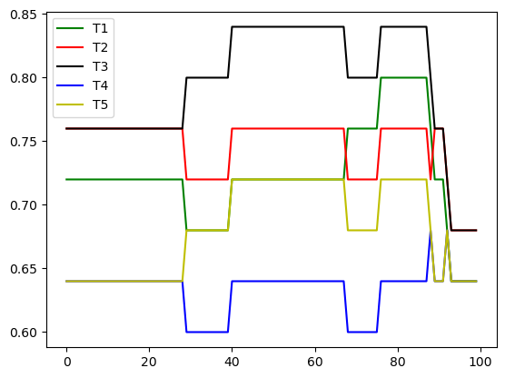

# Machine Learning Term Project

### 20180823 최민제

# Summary

I use question text information and student’s selection rate to train logistic classification model for each data. By two trained model, I ensemble them to get best result.

With this prediction I could get insight that when predicting question quality, each of the five experts has a different sight.

# Introduction

This is a competition to find a model for identifying which problem is good, because when students solve a problem and want to look at the data to measure student learning, the quality of the problem is important for quality of data.

So with the images of question and data of students solution, we have to measure is that a good question.

According to <u>Guide for Diagnostic Questions *1</u>, I try to measure is the question is unambiguous and ask for a single skill/concept.

# Methods

### Github repo : https://github.com/cmj-dev/ssuMlAssignment1

To measure question quality, I use ocr to get text data from images of question. And calculate entropy of student’s selection of choices except answer to measure is that ambiguous question.

## 1. preprocessing

### Entropy

If students' choices tended to be biased except for the answer, I thought the question was likely to be unclear. So I used entropy, which allows us to see the bias toward choices other than the answer option, to learn from that.

The expression below shows how I calculate Entropy of choices except answer.

$$
H = \sum p(x)log_2p(x)
$$

### OCR

There will be a relation between the text information and quality of question. So, I use <u>tesseract *2</u> to get text information from image of questions. And with this text informations, extract text length, word count, average word length predictors for logistic regression.

## 2. Training

To make predictions of score between 0 to 1, I thought it will be significant to use logistic regression. Because it is easy to calculate score value between 0 to 1 and it is possible to put non-binary Y. So, I calculate question’s score by mean of five expert’s choice between two questions with only public dataset.

When I use all the predictors to predict score in logistic regression model, the P-value and z-statistics are not siginificant to reject null hypothesis. So I seperate them with two part. In first model, I use only informations related in text of questions and made logisitic regression model.

And in second model, I only use entropy of choices. It doesn’t show good t-statistics when I use both of answer rate and entropy so I have to remove answer rate from predictors.

With that two models, I ensemble them based on public data. To ensemble them, I got the score with each model and use soft voting method like the expression below.

$$
Score_{ensemble} = r*Score_1 + (1-r)*Score_2
$$

I calculate best $r$ by plotting the best score for r in range of (0, 1)  in 0.01 interval.

## 3. Evaluating

To evaluate the model, I follow the method in <u>Guide for Diagnostic Questions *1</u> , when the left and right question is provided, I calculate each question’s score and compare them. And for each experts T1, T2, T3, T4, T5, get the accuracy and use best accuracy between that five.

# Results

## First model (Text information)

- In first model, I use predictor word count(WordCount), and average of word length(AvgWordLength) and the coefficient and P-value show like this.
    
    
    |  | coef | std err | z | P>|z| |
    | --- | --- | --- | --- | --- |
    | Intercept | 0.2740 | 1.000 | 0.274 | 0.784 |
    | WordCount | 0.0292 | 0.022 | 1.340 | 0.180 |
    | AvgWordLength | -0.1348 | 0.147 | -0.916 | 0.360 |
    
    The result is not that significant to use this single model to predict the score but when I use this model to public dataset, the score looks like this.
    
    | Expert | T1 | T2 | T3 | T4 | T5 |
    | --- | --- | --- | --- | --- | --- |
    | Accuracy | 0.64 | 0.68 | 0.68 | 0.64 | 0.64 |

## Second model (Entropy)

- In second model, I use one predictor entropy and it has more significant z-statistics then the first model.
    
    
    |  | coef | std err | z | P>|z| |
    | --- | --- | --- | --- | --- |
    | Intercept | -4.5937 | 2.118 | -2.169 | 0.030 |
    | Entropy | 5.6491 | 2.532 | 2.231 | 0.026 |
    
    And also the result of prediction in public dataset is great.
    
    | Expert | T1 | T2 | T3 | T4 | T5 |
    | --- | --- | --- | --- | --- | --- |
    | Accuracy | 0.72 | 0.76 | 0.76 | 0.64 | 0.64 |

## **Ensemble**

To get more accuracy in public dataset, I made ensemble model with adjusting value of r in expression before. As we could see in the plot below, when the value of r is between 0.4 to 0.7, model have best performance.

So I calculate private data accuracy with ensemble model have value of r range in 0.4 to 0.7

And as the plot below, when r is 47, score of prediction is almost 0.80.

# Discussion

These results suggest that the entropy of the textual information and choices in a question is a factor in measuring the quality of a question. To be specific, there is a significant tendency of quality got higher when the entropy of choices except the answer choice got increase. And this means unambiguity have significant correlation with question quality. However, there is only a little relationships exist between word count or average word length and question quality.

I can also see that the performance of the ensemble of two models is significantly higher than the performance of each model. However, as you can see from the plot in the results section, the accuracy of each expert varies depending on which model is heavily weighted, indicating that each expert has a different way of judging the quality of the problem. So with this result, we could notice that the question quality should be calculated with many different sights.

Also, in this machine learning method, the each model couldn’t show significant statistical score. So, in real world it will be hard to implement this model to predict question quality. So, we have to find more accurate way to predict the question quality.

# Conclusion

With this project I find that there is some relationship between entropy of choices and question quality but there is not that significant relationships then I expect between text information and question quality.

So, in further steps I have to find other ways to find correlation between text and question quality. Maybe by using natural language processing model to classify the question is good or bad will give some significant result. However to apply this data to natural language processing model, we have to get more data of question quality and use more powerful OCR library. 

# References

1. [Instructions and Guide for Diagnostic Questions: The NeurIPS 2020 Education Challenge](https://arxiv.org/abs/2007.12061)
2. [Tesseract OCR Github](https://github.com/tesseract-ocr/tesseract)